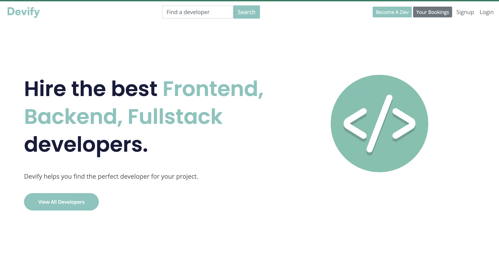
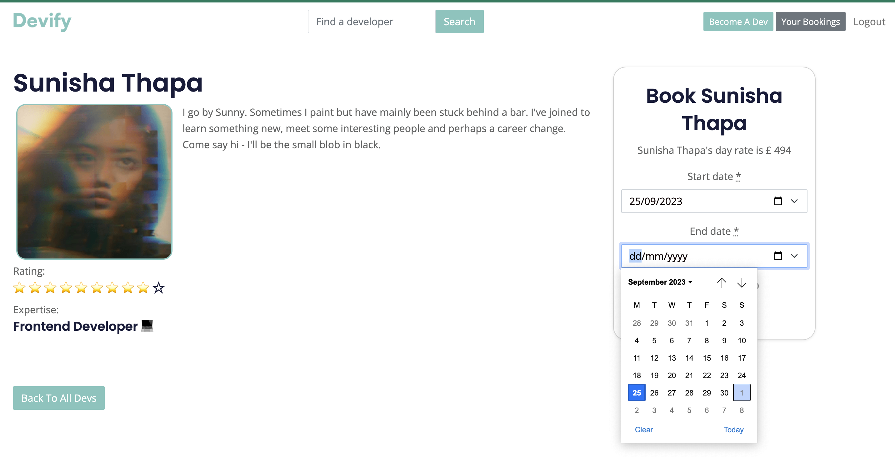
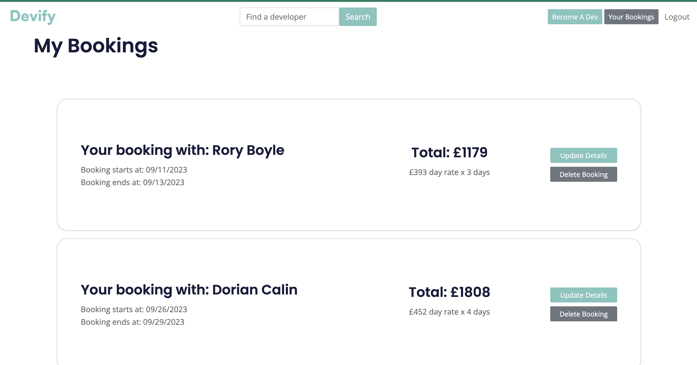

# Devify

## Description

Hire your own Web Developer with a simple click! 

The first Team Project done as a mockup for Airbnb where instead of renting places you rent Web Developers to code for you. 

Designed implemented and shipped to production in Heroku created entirely in Ruby on Rails.

## Visuals

## Authors and acknowledgment
 Devify was the first project made by TheLoop team while studying at Le Wagon bootcamp in London.
 
- [Gorka Echavarri](https://github.com/GorkaEchavarri)
- [Johnny Wordsworth](https://github.com/Wordeu)
- [Richard Vidor](https://github.com/rvidor)
- [Sunny Thapa](https://github.com/Sun-tha)

## Dependencies
Postgresql, Devise, Bootstrap, Simple_form and Cloudinary.

## License
Copyright 2023 TheLoop licensed under the GNU General Public License v3.0 Image assets are licensed under xxx
